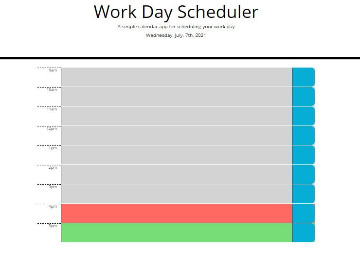

# Third Party APIs work day scheduler  

## Description
This application enables a user to track and save daily events. 

## Table of contents
- [Description](#Description)
- [Installation](#Installation)
- [license](#license) 
- [Contributing](#Contributing)
- [Image](#Image)
- [Questions](#Questions)

## Installation
This application is deployed at the following [website] (https://cassiep1986.github.io/Third-Party-APIs-Work-Day-Scheduler/).

## License

This application is covered under a MIT license. 
To learn more about this license, please visit this [site](https://choosealicense.com/licenses/mit/).

## Contributing
To contribute to this repo, please contact me on GITHUB or by email (Link below).

## Image 

The following image shows the application's user interface:

## Questions
This application can be found on my [github](https://www.github.com/cassiep1986?tab=repositories/).

For additonal questions you can contact me by [email](mailto:cassiep1986@gmail.com).